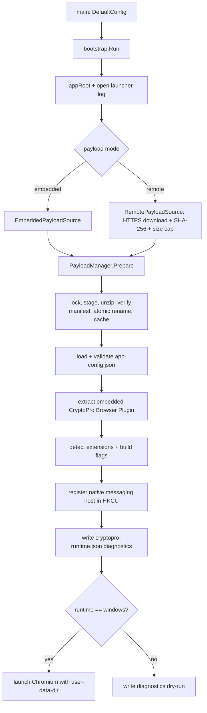

# Architecture

This document describes how the Kriptosfera launcher is structured and what it
does at runtime. It complements the product summary in the root
[`README.md`](../README.md) and the staged plans elsewhere under
[`docs/`](README.md).

## Components

| Area | Package / path | Responsibility |
| :--- | :--- | :--- |
| Entrypoint | `cmd/kriptosfera-launcher` | Load build-time config, call `bootstrap.Run`, surface fatal errors. |
| Bootstrap runtime | `internal/bootstrap` | Prepare payload, wire CryptoPro layer, launch Chromium. |
| Payload sources | `internal/bootstrap` (`payload_source_*`) | `EmbeddedPayloadSource` and `RemotePayloadSource`. |
| Download | `internal/bootstrap/downloader.go` | HTTPS stream + SHA-256 + size cap. |
| CryptoPro layer | `internal/bootstrap/cryptopro_*`, `native_messaging_*` | Extract Browser Plugin bundle, register native messaging host (HKCU). |
| Progress / dialogs | `internal/bootstrap/progress_*`, `dialog_*` | Native Win32 progress window and error dialogs (no-ops elsewhere). |
| Configuration | `internal/config` | `RuntimeConfig` (build-time) and `AppConfig` (payload). |
| Logging | `internal/logging` | Append-only timestamped launcher log. |

Platform specifics are split with build tags into `*_windows.go` and
`*_other.go`, so every package compiles on all platforms; non-Windows hosts run
a diagnostics "dry-run" instead of launching the browser.

## Launcher flow



### Payload preparation invariants

`PayloadManager.Prepare` is safe against concurrent launches and avoids partial
state:

1. fast-path reuse without locking when the ready marker, recorded
   version/mode/SHA-256, and presence of every manifest file all still match
   (full SHA-256 verification is not repeated on every launch — only file
   existence is checked here);
2. otherwise acquire a bootstrap lock (waits for a concurrent first run with a
   bounded timeout; heartbeated so a slow run is not seen as stale) and
   re-check reuse under the lock;
3. open the source, extract into a staging directory, verify every file against
   `manifest.json` by SHA-256, write the state + ready markers, then atomically
   `rename` staging into the final per-version directory.

Extraction rejects zip path traversal, and remote downloads must be HTTPS,
match the pinned SHA-256, and stay within the size cap.

## Runtime layout (per user)

On Windows the app root is `%LOCALAPPDATA%\Kriptosfera`; on other platforms it is
`~/.local/share/Kriptosfera` (used for the dry-run).

```text
<app root>/
  apps/
    demo/
      <version>/                 prepared payload (one dir per payload version)
        chromium/                managed Chromium runtime (Windows builds)
        config/app-config.json   product-facing config
        extensions/              unpacked CryptoPro CAdES extension
        Crypto Pro/
          CAdES Browser Plug-in/  bundled native host, plug-in DLLs, Mini CSP
        diagnostics/             diagnostics.html + cryptopro-runtime.json
        manifest.json            payload file checksums
        .payload-state.json      version / mode / sha256 of prepared payload
        .payload-ready           marker written after successful preparation
    demo<version>.bootstrap.lock bootstrap lock (sibling of the app dir)
  profiles/
    <profileName>/               Chromium user-data-dir (isolated browser profile)
  logs/
    launcher.log
    chromium.stdout.log
    chromium.stderr.log
```

## Configuration layers

- **Build-time** — `RuntimeConfig`, embedded from `runtime-config.json` /
  `app-version.txt`. Chooses payload mode (embedded/remote), version, and (for
  remote) URL, SHA-256, and size.
- **Payload** — `AppConfig`, read from `config/app-config.json` inside the
  prepared payload. Drives the start URL, allowed origins, profile name, window
  mode, diagnostics, and extra Chromium arguments. Validated before launch:
  `startUrl` must be a valid URL within `allowedOrigins` (when configured),
  `diagnosticsUrl` must be HTTPS, and `profileName` must be a safe single path
  segment.

## Distribution variants

- **Embedded launcher** (`KriptosferaDemo.exe`) — payload baked into the binary
  via `go:embed`; works offline, used for demo/support.
- **Thin/remote launcher** (`KriptosferaDemo-remote.exe`, build tag `remote`) —
  downloads an immutable payload by version/SHA on first run and caches it. This
  is the main product direction.
